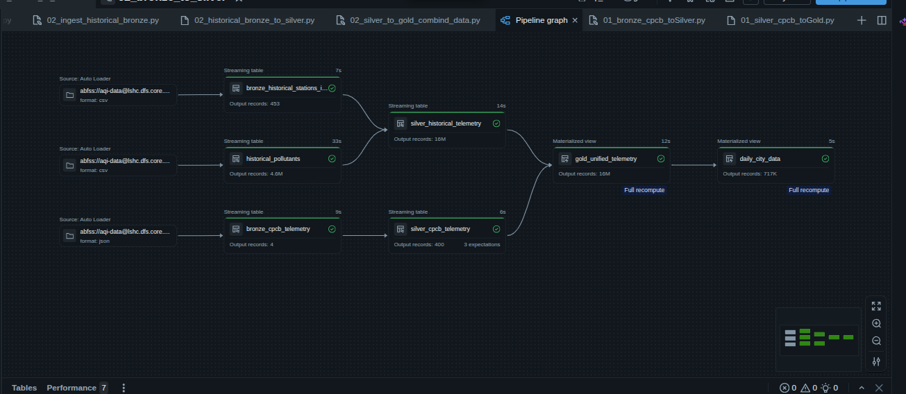
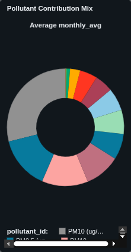

# CPCB Air Quality Lakehouse: Real-Time & Historical AQI Telemetry Pipeline

## 📖 Project Overview
This project establishes a production-grade Medallion data architecture (Bronze, Silver, Gold) on Databricks Unity Catalog. It solves a complex data engineering challenge: unifying a real-time live telemetry stream of Air Quality Index (AQI) data from India's Central Pollution Control Board (CPCB) with a massive 13-year historical batch dataset (2010–2023). 

The resulting Lakehouse powers high-performance geospatial heatmaps and time-series dashboards, enabling both real-time hotspot detection and long-term environmental benchmarking across a single unified fact table.

## 🏗️ Architecture & Data Flow
The pipeline leverages a cross-cloud ingestion strategy. AWS compute resources poll the live API, landing the JSON payloads into Azure Data Lake Storage (ADLS). From there, Databricks Delta Live Tables (DLT) orchestrates the Bronze, Silver, and Gold transformations.



### 🛠️ Tech Stack
* **Compute & Orchestration:** Databricks, Delta Live Tables (DLT), Databricks Workflows
* **Data Processing:** PySpark, Spark Structured Streaming, Databricks Notebooks[cite: 3]
* **Storage & Governance:** Azure Data Lake Storage Gen2 (ADLS), Delta Lake, Unity Catalog
* **Cloud Infrastructure:** AWS (API Ingestion/Routing), Microsoft Azure (Storage)
* **Visualization:** Databricks Dashboards (Lakeview)

---

## ⚙️ Medallion Pipeline Implementation

### 🥉 Bronze Layer: Raw Ingestion
* **Continuous Processing:** Utilized Databricks Auto Loader (`cloudFiles`) to incrementally and efficiently ingest real-time JSON API payloads and raw historical CSV batches from ADLS into immutable Delta tables[cite: 7].
* **Resilient Storage:** Inferred and captured raw schemas while retaining the original data formats as a resilient historical fallback, ensuring zero data loss if downstream transformations fail.

### 🥈 Silver Layer: Cleansing, Normalization & Joins
The core engineering heavy-lifting occurs in the Silver layer, standardizing highly disparate batch and streaming schemas[cite: 8].
* **Dynamic Dimension Joins:** Extracted file names dynamically using Unity Catalog's built-in `_metadata.file_name` struct. Applied PySpark `regexp_replace` to strip `.csv` extensions, enabling accurate inner joins against station geography mapping files.
* **Wide-to-Tall Schema Unpivoting:** The 13-year historical dataset featured a "wide" schema, whereas the live API utilized a "tall" telemetry schema (`pollutant_id`, `pollutant_avg`). Engineered PySpark `unpivot` functions to melt the historical data into an identical structural format[cite: 8].
* **Delta Constraint Resolution:** Handled invalid characters (spaces, parentheses) inherent in the raw dataset by dynamically enabling Databricks Column Mapping (`"delta.columnMapping.mode": "name"`) and explicitly escaping column names in PySpark.

### 🥇 Gold Layer: Business Aggregation & Unification
* **Unified Fact Table:** Executed a seamless `unionByName(allowMissingColumns=True)` operation to stack 13 years of historical records directly beneath the live telemetry stream[cite: 9].
* **Geospatial Backfilling:** The historical dataset lacked spatial data. Created a distinct Geography Dimension table from the live CPCB stream, broadcasting and backfilling accurate `latitude` and `longitude` coordinates across all 13 years of historical records.
* **Dashboard Optimization:** Built summary tables to pre-calculate daily averages and maximums grouped by exact geospatial coordinates, ensuring sub-second rendering times for BI tools.

---

## 📊 Dashboards & Key Insights
The Gold layer natively feeds into Databricks Dashboards, transforming millions of rows into actionable operational intelligence. 

1. **Pollutant Contribution Mix:** Breaks down the specific drivers of poor AQI, distinguishing between vehicular emissions and other particulate matter spikes.


2. **Top 10 States by Average Pollutant Level:** Provides a clear, ranked leaderboard of the most polluted areas for immediate operational focus.


3. **Monthly Average Pollutant Levels Over Time:** Contextualizes current air quality by mapping long-term historical seasonality and trend lines.


---

## 📁 Repository Structure
```text
cpcb-aqi-lakehouse/
├── 00_connection_and_schema_test        # Workspace Notebook[cite: 3]
├── 01_lakehouse_schema                  # Workspace Notebook[cite: 3]
├── API_data_feed_to_ADLS/               # Cross-cloud API ingestion logic[cite: 3]
│   └── aqi_feed.py                      # Python script for fetching live data
├── assets/                              # Dashboard and architecture visualizations[cite: 3]
│   ├── Monthly Average Pollutant Levels Over Time.png    #[cite: 10]
│   ├── pipeline_graph.png                                #[cite: 10]
│   ├── Pollutant Contribution Mix.png                    #[cite: 10]
│   └── Top 10 States by Average Pollutant Level.png      #[cite: 10]
├── streaming pipelines/                 # Core Medallion architecture DLT code[cite: 3]
│   ├── 01_raw_to_bronze/                #[cite: 6]
│   │   ├── 01_ingest_cpcb_bronze.py     # Live API Auto Loader configuration[cite: 7]
│   │   └── 02_ingest_historical_bronze.py # Historical batch ingestion[cite: 7]
│   ├── 02_bronze_to_silver/             #[cite: 6]
│   │   ├── 01_bronze_cpcb_toSilver.py   # Live data cleansing[cite: 8]
│   │   └── 02_historical_bronze_to_silver.py # Schema unpivoting and metadata joins[cite: 8]
│   └── 03_silver_to_gold/               #[cite: 6]
│       ├── 01_silver_cpcb_toGold.py     # Gold dimension generation[cite: 9]
│       └── 02_silver_to_gold_combind_data.py # unionByName unified fact table[cite: 9]
└── Readme.md                            # Project documentation[cite: 3]

## Contact
Built as a data engineering portfolio project demonstrating real-time streaming, lakehouse architecture, and production-grade data quality patterns.

For questions or collaboration opportunities, connect via:

LinkedIn: linkedin.com/in/ankitbisht007
GitHub: Check out more projects in my repositories
